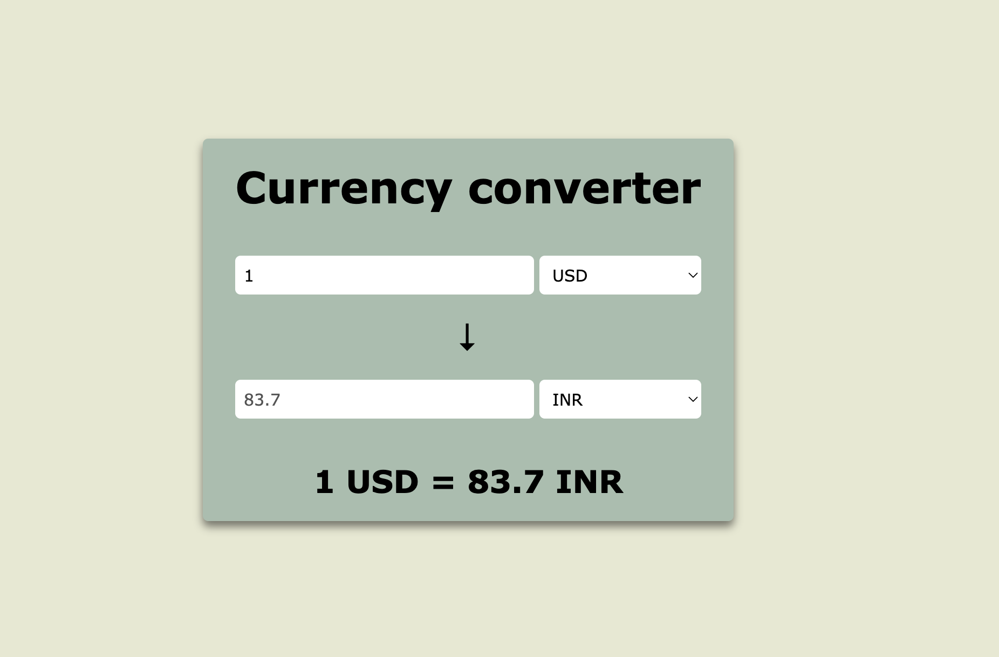

# Currency Conversion Webpage



## Description

This project is a simple, yet effective currency conversion webpage. It uses a currency API to convert real-time exchange rates between different currencies. The webpage is built with HTML, CSS, and JavaScript.

## Features

- Real-time currency conversion using a reliable currency API
- Supports multiple currencies from different countries
- Simple and user-friendly interface
- Responsive design for mobile and desktop views

## Installation

To get a local copy up and running follow these simple steps.

### Prerequisites

- A modern web browser
- Internet connection for fetching real-time exchange rates

### Installation Steps

1. Clone the repository:
    ```sh
    git clone https://github.com/yourusername/currency-conversion.git
    ```

2. Navigate to the project directory:
    ```sh
    cd currency-conversion
    ```

3. Open `index.html` in your web browser:
    ```sh
    open index.html
    ```

## Usage

1. Open the webpage in your web browser.
2. Select the currency you want to convert from.
3. Select the currency you want to convert to.
4. Enter the amount you want to convert.
5. The converted amount will be displayed in real-time.

## API

This project uses the Currency API to fetch real-time exchange rates. You will need an API key to use this service. Sign up on the currency API provider's website to get your API key.

## Contributing

Contributions are what make the open-source community such an amazing place to learn, inspire, and create. Any contributions you make are **greatly appreciated**.

1. Fork the Project
2. Create your Feature Branch (`git checkout -b feature/AmazingFeature`)
3. Commit your Changes (`git commit -m 'Add some AmazingFeature'`)
4. Push to the Branch (`git push origin feature/AmazingFeature`)
5. Open a Pull Request
